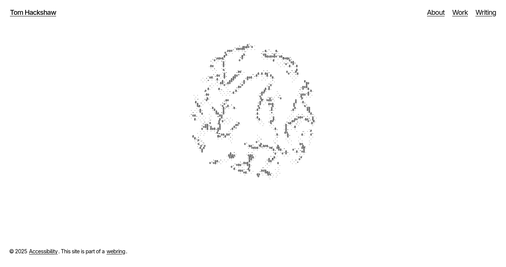

# wwwtom



A website of my very own, and my first foray into [Solid Start](https://start.solidjs.com/) and Turborepo.

This is still very much a work in progress and has some rough edges. I'm still fairly new to [Solid](https://solidjs.com).

I'm using this monorepo as a means of exploring different technologies and patterns, mostly for my own enjoyment.

## Developing

```bash
pnpm run dev # Start development server
pnpm run build # Production build
pnpm run lint # Run oxlint
pnpm run format # Check formatting with oxfmt
pnpm run write # Format files with oxfmt
```

External packages and dependencies have been deliberately kept small in order to keep the project lean.

Content is fetched from a headless [Payload CMS](https://payloadcms.com/) instance for the posts and works routes/slugs. All of the types and config is Payload specific, but could be swapped to a CMS of your choice.

## Deployment

The main site is pretty cheap and bare bones. It uses Cloudflare Workers and Wrangler to build and deploy. All static media assets like images are hosted on a separate CDN to keep things lightweight and fast.

It will be fairly obvious looking through this project that I use a lot of Cloudflare specific services and products like the Worker runtime, Wrangler and KV. This means it probably isn't as "portable" as it could be, but it wouldn't be too difficult for someone to fork and replace Worker specific config for Node, Deno etc.

In a future release I intend on moving to Alchemy V2 for IaC. 

## Testing

I use Vitest for snapshot and integration tests.

## License

This is free software under the GPL. However, I kindly ask that you do not repost my work/images without permission or present this as your own.
